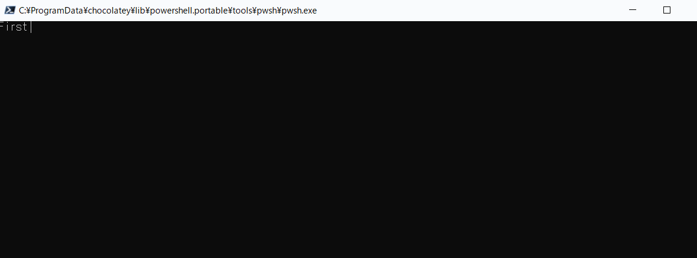

<h1 align="center">Terminal Flow - UI for C# Console</h1>

This is a C#(dotnet) library for making your design of CUI tool better.

<h2>Demo</h2>

You can test them by running `dotnet run` on `/src/Example`.

<h3>Progress bar example</h3>

</img>

``` C#
// using System;
// using System.Threading.Tasks;
// using TerminalFlow;

//
// Initalize ConsoleFlow.
//
var flow = new ConsoleFlow();

//
// Create ProgressBar components and attach to ConsoleFlow.
//
var firstProgress = new ConsoleProgressBar(title: "First", length: 100);
flow.Add(firstProgress);

var secondProgress = new ConsoleProgressBar(title: "Second", length: 100);
flow.Add(secondProgress);

//
// Print contents to the terminal.
//
flow.Display();

//
// Change the value of ProgressBar.
// And you will see the components are changed corresponding to the value.
//
for (int i = 0; i <= 50; i++)
{
    firstProgress.Value = i / 100f;
    Task.Delay(100).Wait();
}
for (int i = 0; i <= 100; i++)
{
    secondProgress.Value = i / 100f;
    Task.Delay(100).Wait();
}
for (int i = 50; i <= 100; i++)
{
    firstProgress.Value = i / 100f;
    Task.Delay(100).Wait();
}

//
// Wait user input for preventing from finishing.
//
Console.ReadKey();
```
